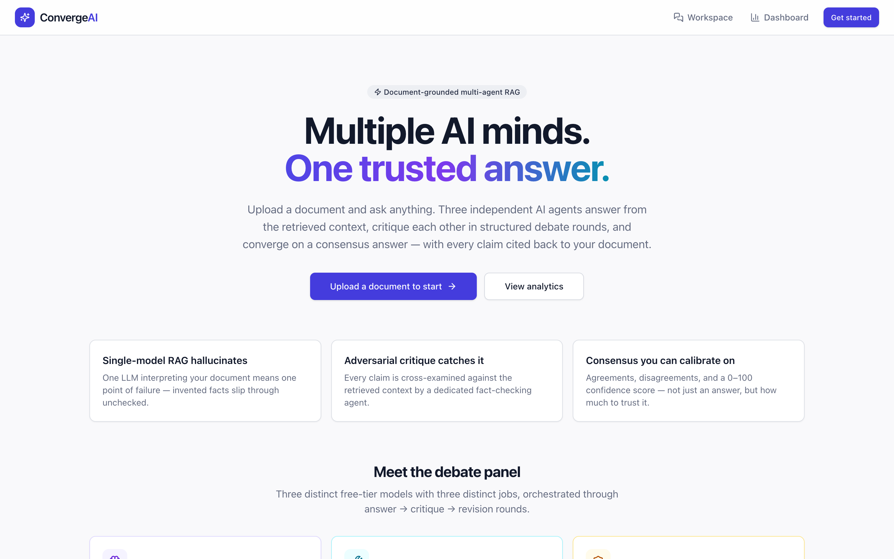
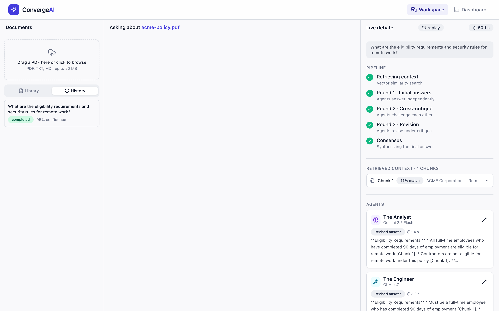
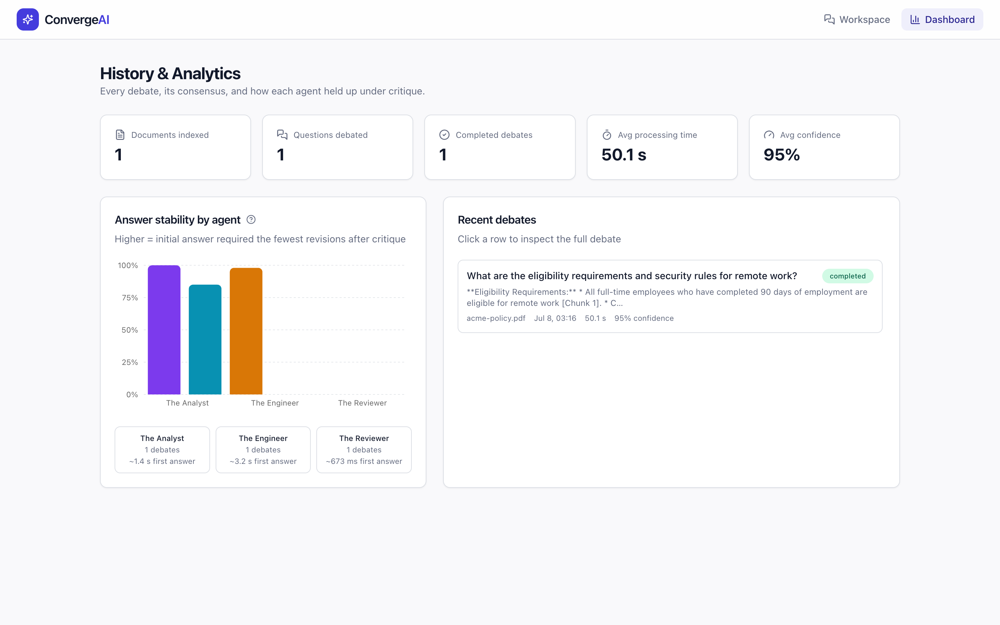

# ConvergeAI

> **Multiple AI minds. One trusted answer.**

[](https://github.com/bhargav-urs/ConvergeAI/actions/workflows/ci.yml)
[](LICENSE)


ConvergeAI is a document-grounded **multi-agent AI debate platform**. Upload a PDF and ask a
question — instead of trusting a single LLM, a structured RAG pipeline retrieves the relevant
context and **three independent AI agents debate the answer**: they answer, cross-critique each
other, revise under pressure, and converge on a consensus with a calibrated confidence score.
Every stage streams live to the browser over STOMP WebSockets.

## Screenshots

**Landing** — the product overview and the three-agent debate panel.



**Workspace** — three-panel RAG workspace: document library, chat, and the live debate pipeline
streaming every stage (retrieval → 3 rounds → consensus) with per-agent answers and citations.



**Dashboard** — history and analytics, including per-agent answer-stability under critique.



## Why

Single-model RAG hallucinates: one LLM interpreting your document is one point of failure.
ConvergeAI enforces an adversarial debate loop so unsupported claims are caught **before** the
answer reaches the user — and disagreements are surfaced honestly instead of papered over.

## Architecture

```
┌───────────────┐   REST + STOMP/SockJS   ┌──────────────────────────────────────┐
│  React 18 SPA │ ◄─────────────────────► │  Spring Boot 3 (Java 21, virtual     │
│  Vite · TS    │                         │  threads)                            │
│  Zustand ·    │                         │                                      │
│  React Query  │                         │  Apache Tika ──► chunking ──►        │
└───────────────┘                         │  ONNX MiniLM (in-process, free)      │
                                          │        │                             │
                                          │        ▼                             │
                                          │  PostgreSQL + pgvector (HNSW)        │
                                          │        │  top-5 cosine retrieval     │
                                          │        ▼                             │
                                          │  Debate orchestrator                 │
                                          │   R1 answers → R2 critiques →        │
                                          │   R3 revisions → consensus JSON      │
                                          │        │                             │
                                          │        ▼                             │
                                          │  OpenRouter (free-tier models)       │
                                          │   DeepSeek-R1 · Qwen 3 · Llama 3.3   │
                                          └──────────────────────────────────────┘
```

**The debate panel**

| Agent | Default model | Role |
|---|---|---|
| The Analyst | `openai/gpt-oss-120b:free` | Deep logical reasoning, step-by-step fact extraction |
| The Engineer | `qwen/qwen3-next-80b-a3b-instruct:free` | Practical synthesis into a direct, actionable answer |
| The Reviewer | `meta-llama/llama-3.3-70b-instruct:free` | Adversarial fact-checking against the retrieved context |

OpenRouter's free-tier catalog rotates (the brief's DeepSeek-R1 and Qwen3-235B free slots have
already been retired), so all four model slots are env-overridable without a rebuild.

**Direct fast providers (recommended):** set `GROQ_API_KEY`, `CEREBRAS_API_KEY`, and/or
`GEMINI_API_KEY` (all free tiers on fast hardware) and each agent routes directly —
Analyst → Gemini 2.5 Flash, Engineer → GLM-4.7 on Cerebras, Reviewer/Consensus →
Llama-3.3-70B on Groq — cutting a debate from minutes to well under a minute, still at $0.
Any missing key silently falls back to the OpenRouter pool.

**Debate modes:** the chat has a Normal/Fast toggle. Normal runs the full 3-round debate;
Fast runs one round of concise answers straight into consensus (~3× fewer sequential phases,
capped output budgets) for quick, lighter-scrutiny answers.

The consensus engine (Llama 3.3) merges the revised answers into strict JSON:
`final_answer`, `areas_of_agreement`, `areas_of_disagreement`, `confidence_score` (0–100).

## Tech stack

- **Backend** — Java 21, Spring Boot 3.5, Spring Data JPA, Spring WebSocket (STOMP + SockJS),
  LangChain4j (Tika parsing, recursive splitting, quantized ONNX `all-MiniLM-L6-v2` embeddings —
  zero API cost), Flyway, `hibernate-vector` for typed `vector(384)` mapping, virtual threads
  for the parallel agent fan-out.
- **Database** — PostgreSQL + pgvector (HNSW index, cosine distance). Works with Neon free tier.
- **Frontend** — React 18, TypeScript (strict), Vite, Tailwind CSS + shadcn-style components,
  Zustand (live debate state machine), TanStack Query (server state), `@stomp/stompjs` + SockJS.
- **AI access** — multi-provider routing over the OpenAI-compatible chat API: each agent hits a
  fast free-tier provider (Groq / Cerebras / Gemini) first and falls back to the OpenRouter pool,
  with retry/backoff, `Retry-After` handling, and graceful per-agent degradation.

## Getting started (local)

Prereqs: Java 21+, Maven, Node 20+, Docker.

```bash
# 1. Start pgvector PostgreSQL (mapped to host port 5433 to avoid clashing
#    with any natively installed PostgreSQL on 5432)
docker compose up -d postgres

# 2. Backend (http://localhost:8080)
export OPENROUTER_API_KEY=sk-or-v1-...   # free key: https://openrouter.ai/keys
cd backend && mvn spring-boot:run

# 3. Frontend (http://localhost:5173)
cd frontend && npm install && npm run dev
```

Or run everything containerized:

```bash
OPENROUTER_API_KEY=sk-or-v1-... docker compose --profile full up --build
# frontend on http://localhost:8081, backend on http://localhost:8080
```

Environment reference: see [.env.example](.env.example). All four model slots are overridable
(`MODEL_ANALYST`, `MODEL_ENGINEER`, `MODEL_REVIEWER`, `MODEL_CONSENSUS`) since OpenRouter's
free-tier availability rotates.

## API surface

| Method | Path | Purpose |
|---|---|---|
| `POST` | `/api/documents` | Upload PDF/TXT/MD (multipart `file`), async indexing, returns 202 |
| `GET` | `/api/documents` | List documents with indexing status |
| `GET` | `/api/documents/{id}/chunks` | Paged chunk visualization |
| `DELETE` | `/api/documents/{id}` | Delete document + cascade |
| `POST` | `/api/questions` | Submit question, starts the debate, returns 202 |
| `GET` | `/api/questions?documentId=` | Debate history |
| `GET` | `/api/questions/{id}` | Full debate detail (context, all rounds, consensus) |
| `GET` | `/api/analytics/summary` | Dashboard stats incl. per-agent stability |
| `WS` | `/ws` | STOMP endpoint (raw WebSocket + SockJS fallback) |

**STOMP topics**

- `/topic/debate/{questionId}` — `stage.changed`, `context.retrieved`, `agent.response`,
  `agent.critique`, `agent.revision`, `consensus.generated`, `debate.completed`, `debate.error`
- `/topic/documents` — `document.indexed` (chunk count), `document.failed`
- `/app/debate` — client-side `question.submit` (REST is the primary path; the reply arrives on
  `/topic/debate/requests/{clientRequestId}`)

Missed-event safety: after subscribing, the client hydrates once from
`GET /api/questions/{id}`, so a debate that raced ahead of the subscription is fully recovered.

## Design decisions worth knowing

- **Cosine (`<=>`) instead of L2 (`<->`)** for similarity: MiniLM embeddings are L2-normalized,
  cosine is the natural metric and matches the HNSW index operator class.
- **Chunking is character-based** (2000 chars / 200 overlap ≈ 500/50 tokens for English prose)
  to avoid a tokenizer dependency; both knobs are configuration.
- **Free-tier resilience** (learned from production testing): every request carries an
  OpenRouter **fallback routing list** (`models`, capped at 3 entries by the API) so a
  rate-limited primary transparently falls through to an available free model — the DB records
  which model actually answered. Retries honor the server's **`Retry-After`** cool-down
  (upstream 429s often demand ~20s, longer than naive exponential backoff waits). Reasoning
  models get `reasoning: {effort: "low"}` and a 4096-token budget so they don't burn the whole
  completion on chain-of-thought and return an empty answer.
- **Failure policy**: a permanently failing agent is recorded and skipped, and a failed
  round-3 revision falls back to that agent's round-1 answer for consensus. The debate only
  fails outright if *all* agents fail round 1 — and the error message quotes the real
  per-agent causes.
- **Consensus JSON is parsed defensively** (markdown fences, key aliases, 0–1 confidence
  scales), with one model-driven "reformat to valid JSON" repair attempt before falling back to
  the raw text.
- **Analytics "stability" metric** = word-level Jaccard similarity between an agent's round-1
  and round-3 answers over the last 100 completed debates — higher means the initial answer
  survived critique with the fewest revisions.

## Deployment (free tier)

1. **Neon** — create a project, enable nothing special (Flyway runs `CREATE EXTENSION vector`).
   Note the JDBC URL, user, password.
2. **Render** — new Web Service from this repo, root `backend/`, environment *Docker*.
   Set `DATABASE_URL` (JDBC form: `jdbc:postgresql://<neon-host>/<db>?sslmode=require`),
   `DATABASE_USERNAME`, `DATABASE_PASSWORD`, `OPENROUTER_API_KEY`,
   `CORS_ALLOWED_ORIGINS=https://<your-app>.vercel.app`.
3. **Vercel** — import the repo, root `frontend/`, framework *Vite*.
   Set `VITE_API_BASE_URL=https://<your-service>.onrender.com`.

## Testing

```bash
cd backend && mvn test        # consensus parsing, prompt construction, similarity metric
cd frontend && npm run build  # strict typecheck + production build
```

## Project layout

```
backend/
  src/main/java/com/convergeai/
    ai/          OpenRouter client (RestClient, retries, R1 <think> stripping)
    config/      properties, CORS, STOMP broker, ONNX embedding model, virtual threads
    domain/      JPA entities (vector(384) via hibernate-vector, JSONB consensus points)
    repository/  Spring Data + native pgvector similarity search
    service/     ingestion worker, retrieval, analytics
    service/debate/  prompts, orchestrator, consensus parser, event publisher
    web/         REST controllers, STOMP controller, RFC 7807 error handling
  src/main/resources/db/migration/  Flyway schema (pgvector, HNSW index)
frontend/
  src/lib/       typed API client, STOMP manager, agent metadata
  src/store/     Zustand debate state machine
  src/hooks/     React Query + WebSocket hooks
  src/components/  ui primitives, workspace (3-panel), dashboard, landing
```

## License

Released under the [MIT License](LICENSE).
